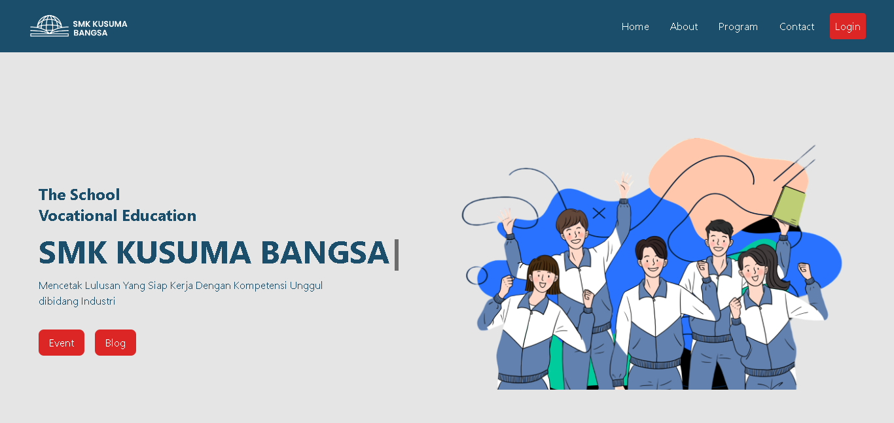

# SMK Kusuma Bangsa

A Kusuma Bangsa Vocational School website that upholds the integration of academic information systems (SIAKAD).

### Live Demo
[Website Demo](https://smkkusumabangsa-b2018.web.app/)

## Features
### Website
- **About**: Provides information about the school's vision and mission.
- **Programs**: Details the various departments and programs offered by the school.
- **Contact**: Directs users on how to get in touch with the school.

### SIAKAD Integration
- **Login System**:
  - Admin, Teacher, and Student roles, each with specific functionalities.
  - Admin can add data for teachers and students, create classes, add subjects, and post announcements for the school community.
  - Teachers can view schedules, enter grades for their classes, and mark attendance.
  - Students can view announcements and check their grades.

### Login SIAKAD
1. For Admin: `admin@admin.com` / `admin123`
2. For Teacher: `pakman@gurukubangsa` / `pakman123`
3. For Student: `siswa@siswabangsa` / `siswa123`

## Technologies Used
### Website
- **React.js**: For building the user interface.
- **Tailwind CSS**: For styling and layout customization.
- **TypeScript**: Adds type safety to JavaScript.
- **Framer Motion**: For animations and transitions.

### SIAKAD
- **Laravel**: Backend framework for managing the SIAKAD system.
- **Bootstrap**: For responsive and modern UI design.
- **jQuery**: For simplifying JavaScript operations.

## Team
This project was developed by a team of 8 members, including programmers and UI/UX designers, as part of a college assignment.

## Contribution
At this moment, the project is private and contributions are not accepted.

## License
This project is licensed under the [MIT License](LICENSE).
